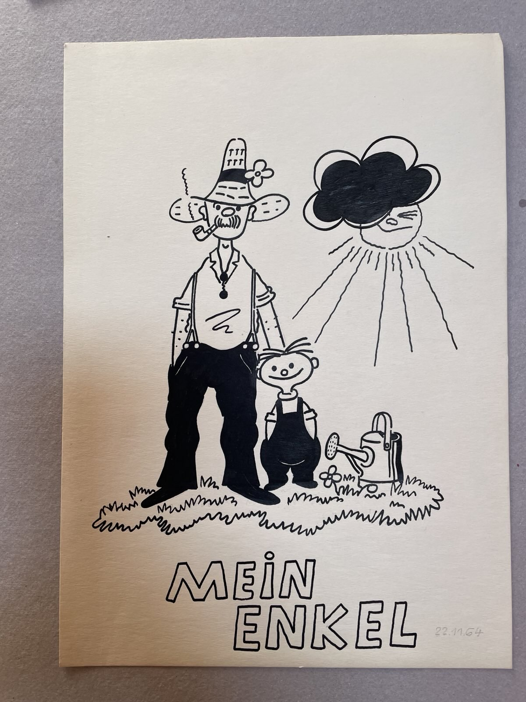
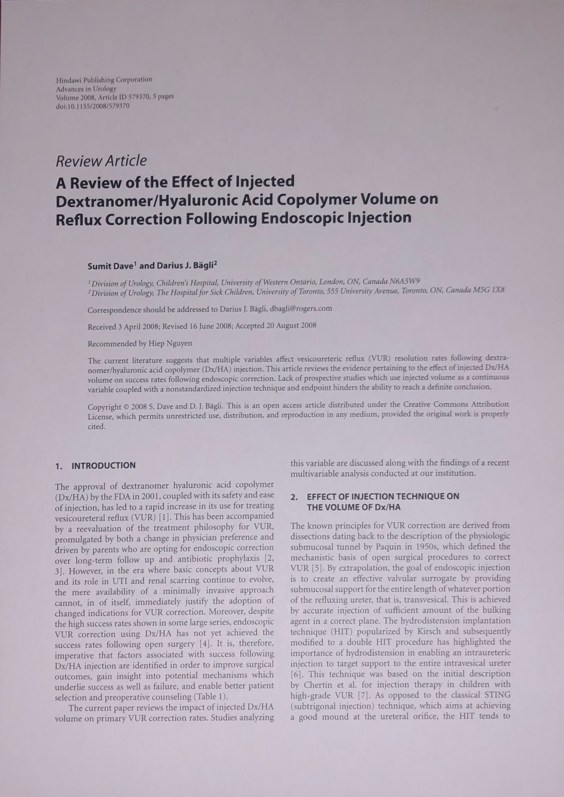

# Cropikatur

A command-line tool to automatically detect and crop documents (like scanned pages or sheets of paper) from images using OpenCV.
Supports batch cropping of entire folders and produces perspective-corrected outputs.

## Example

<p align="center">
  
  
</p>

---

## Features

- Detects rectangular paper-like documents in images
- Automatically applies perspective correction
- Works with individual files or entire folders
- Optional debugging view of intermediate image processing steps
---

## Setup

### Requirements
- tested on python 3.12.11
- further requirements are documented in `requirements.txt` and can be installed using pip

```bash
pip install -r requirements.txt
```

## Run
```bash
python cli.py input.jpg               # saves as input_cropped.jpg
python cli.py input.jpg output.jpg    # saves as output.jpg
python cli.py folder/                 # batch mode: outputs to folder_cropped/
python cli.py folder/ output_folder/  # batch mode with custom output folder
```

Optionally, intermediate steps can be shown when using the `--debug` flag

