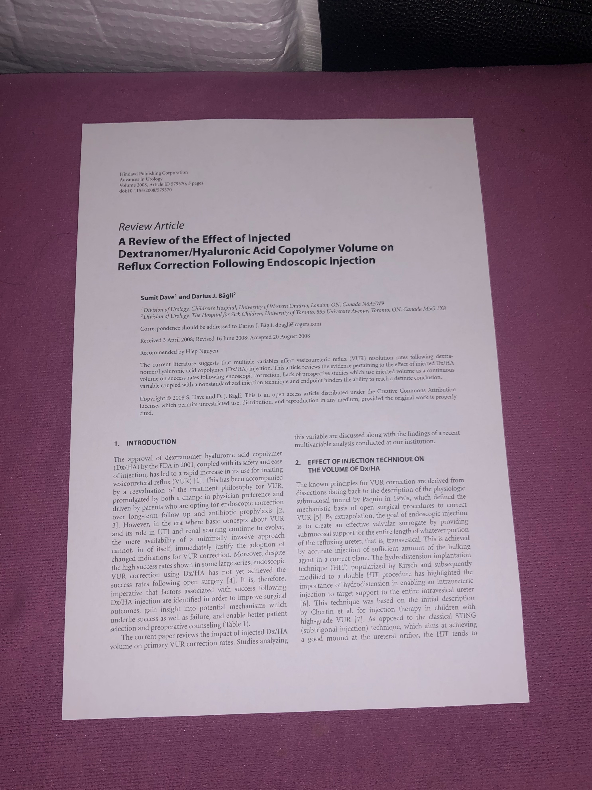

# Cropikatur

A command-line tool to automatically detect and crop documents (like scanned pages or sheets of paper) from images using OpenCV.
Supports batch cropping of entire folders and produces perspective-corrected outputs.

## Example

<p align="center">
  
  
</p>

---

## Features

- Detects rectangular paper-like documents in images
- Automatically applies perspective correction
- Works with individual files or entire folders
- Optional debugging view of intermediate image processing steps
---

## Setup

### Requirements
- tested on python 3.12.11
- further requirements are documented in `requirements.txt` and can be installed using pip

```bash
pip install -r requirements.txt
```

## Run
```bash
cropikatur input.jpg               # saves as input_cropped.jpg
cropikatur input.jpg output.jpg    # saves as output.jpg
cropikatur folder/                 # batch mode: outputs to folder_cropped/
cropikatur folder/ output_folder/  # batch mode with custom output folder
cropikatur folder/ output_folder/ --aspect-ratio Ax             # like above but with set aspect ratio
cropikatur folder/ output_folder/ --debug --aspect-ratio "16/9" # like above but with set aspect ratio and debug mode
```

Optionally, intermediate steps can be shown when using the `--debug` flag
Optionally, it is possible to specify an aspect ratio. All images within this batch are then rescaled to this aspect ratio.
Available ratios include:
- Ax (like A4, A5, A6, ...)
- Bx (like B4, B5, B6, ...)
- Cx (like C4, C5, C6, ...)
- 16/9
- 3/2
- square

Note that using aspect ratios never decreases the resolution.

